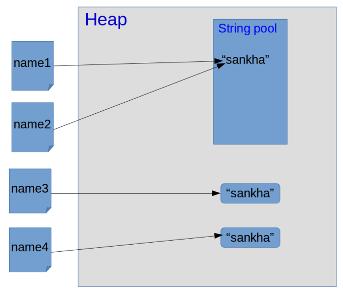

Strings are one of the most used concepts in any programming language. When it comes to **String manipulation** Java is one of the best languages going around. The **Java String Class** has many in-built methods to do so.

In java, there are **two** different **ways** to **create a String**.

1. String literals

```java
String str = "hello world";
```

2. String objects

```java
String str2 = new String("hello world");
```

Both these two types of String end up in the **Heap** **section** of the **Memory**. But in two different sections. **String literals** go to the special section in the Heap called **“String pool”**. **String objects** lay out in the **Heap** as same as other objects.

### String pool

String pool is a special place. It does **not allow duplicates**. Once we create a String literal as same as a one in the String pool, **reference variable point into old string that was already there**. For example,

```java
String name1 = "sankha";
String name2 = "sankha";
```

after the **first line**, String pool will contain, a **string** called **"sankha"** and **name1** will be **pointed to that string**. After the **second line**, String pool **will not create a new String**, **name2** will end up **pointing** **to** **same "sankha"** String that already in the String pool.

### String Objects

```java
String name3 = new String("sankha");
String name4 = new String("sankha");
```

When we use String object to create new Strings, there will be **two separate objects** with the **reference** of **name3**, **name4** will end up in **Heap**.



**String** are **immutable objects** in java. It means that it means every time string when was changed It will end up being **creating new** String. It will **never modify** the object that already instantiated in the Java Virtual Machine.
