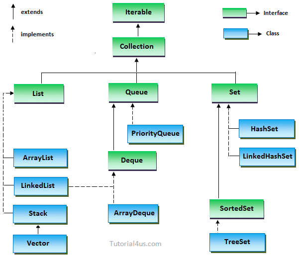
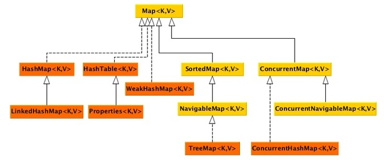

# Java Collections Framework vs Java Map Interface

## Java Collections Framework

Collections in Java is a framework that provides an architecture to store and manipulate the group of objects. Operations that you can perform (searching, sorting, insertion, manipulation, deletion ) on any data can be performed by Java collections.

Collections frameworks in Java provides a ready-made architecture with a set of classes and Interfaces. Frameworks are optional. You either can use it or not.

## Java Map Interface

A map contains values on the basis of key i.e. key and value pair. Each key and value pair is known as an entry. A map contains only unique keys.

A map is useful if you have to search, update or delete elements on the basis of the key.

> Maps are not a part of the Java collection framework.

It’s important to note that, Maps are not a part of the Java collection framework. Maps work with key/value pairs, while the other collections work with just values. Map maps keys to values. It allows its content to be viewed as a set of keys, a collection of values and a set of key-value mappings.

Java collections API consist of three major Interfaces.

1. List
2. Queue
3. Set

#### [List](): An interface representing a Collection whose elements are ordered and each has a numeric index representing its position, where zero is the first element, and (length - 1) is the last.

    * [ArrayList](): A List backed by an array, where the array has a length (called "capacity") that is at least as large as the number of elements (the list's "size"). When size exceeds capacity (when the (capacity + 1)-th element is added), the array is recreated with a new capacity of (new length * 1.5)–this recreation is fast since it uses `System.arrayCopy()`.
     Deleting and inserting/adding elements requires all neighbouring elements (to the right) be shifted into or out of that space. Accessing any element is fast, as it only requires the calculation (element-zero-address + desired-index * element-size) to find it’s location. In most situations, an ArrayList is preferred over a LinkedList.
    
    * [LinkedList](): A List backed by a set of objects, each linked to its “previous” and “next” neighbours. A LinkedList is also a Queue and Deque. Accessing elements is done starting at the first or last element, and traversing until the desired index is reached. Insertion and deletion, once the desired index is reached via traversal is a trivial matter of re-mapping only the immediate-neighbour links to point to the new element or bypass the now-deleted element.

#### [Set](): An interface representing a Collection with no duplicates.

    * HashSet: A Set backed by a Hashtable. Fastest and smallest memory usage, when ordering is unimportant.*[LinkedHashSet](): A HashSet with the addition of a linked list to associate elements in insertion order. The “next” element is the next-most-recently inserted element.
    
    * [TreeSet](): A Set where elements are ordered by a Comparator (typically natural ordering). Slowest and largest memory usage, but necessary for comparator-based ordering.
    
    * [EnumSet](): An extremely fast and efficient Set customized for a single enum type.

#### [Queue](): An interface that represents a Collection where elements are, typically, added to one end, and removed from the other (FIFO: first-in, first-out).

### [Map](): An interface representing a Collection where each element has an identifying “key”–each element is a key-value pair. But This is not a part of the Collection framework.

    * [HashMap](): A Map where keys are unordered and backed by a Hashtable.
    
    * [LinkedhashMap](): Keys are ordered by insertion order.
    
    * [TreeMap](): A Map where keys are ordered by a Comparator (typically natural ordering).
       [Stack](): An interface that represents a Collection where elements are, typically, both added (pushed) and removed (popped) from the same end (LIFO: last-in, first-out).
    
    * [Deque](): Short for “double-ended queue”, usually pronounced “deck”. A linked list that is typically only added to and read from either end (not the middle).

