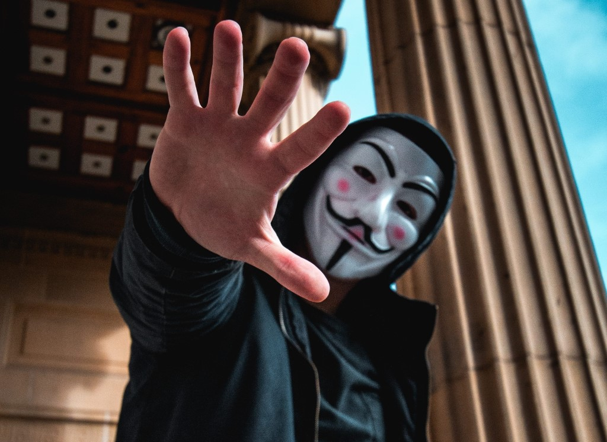

Have you ever **check** emails in your **Gmail Spam folder**, It's fun, once in every 3 to 4 months I open my E-Mail Spam inbox and check what's new. When last time I did that these are some of the things I found..!

- **3 universities** are giving me **scholarships** for **Master’s/Doctoral degree programs** in random subjects.
- **10 bank**s are giving me **easy loans**.
- **5 Job** companies have best jobs for me.
- I have won **GBP 10000000** and **USD 500000** for unknown reasons.
- **4 matrimonial** sites have most **suited** **matches** for **me**.
- **Dr Rajan** has claimed that he will **cure** my **hair fal**l.
- And Approx **40-50 emails** from **Priyanka**, **Rakith**, and **Neha** who are feeling **lonely** and **want to meet me.**

So, the **Internet** is a **wired** **place**, like a society there are many kinds of actors who wanders around. In a normal society, there are guidelines, laws, traditions to restrict and control their behavior. But in the cyberspace, there are **no restrictions** or **traditions**. You can do whatever you want however you want it.

But in the cyber realm, there is an **advantage**. Unlike in the real world, you are **not physically there**. Since **no one can force you** to do anything that you don't want to do. So what they do is **trick** you to do **what they want**, mostly using **social engineering** techniques. if you act **vigilant** and **careful** in the cyberspace, **no one can hurt you**.

> "There are only two types of people on the Internet: those who been hacked, and those that will be."

#### Here are *5 tips* to help you get started:

1. **Create Complex Passwords.**

     I know you’ve heard it before, but creating **strong, unique passwords** for all your critical accounts really is the best way to keep your personal and financial information safe. This is especially true in the era of widespread **corporate hacks**, where one database breach can reveal tens of thousands of user passwords. If you reuse your passwords, a hacker can take the leaked data from one attack and use it to log in to your other accounts. My best advice: use a password manager like **last-pass** to help you store and create **strong passwords** for all of your accounts.

2. **Click Smart.**

     Now that you’ve put smart tech measures into place, make sure that you **don’t invite danger with careless clicking.** Many of today’s online threats are based on **phishing** or **social engineering**. This is when you are tricked into revealing personal or sensitive information for fraudulent purposes. Spam emails, phony “free” offers, click bait, online quizzes and more all use these tactics to entice you to click on **dangerous links** or give up your personal information. Rule of Thumb on Internet: No one give you free staff. Always be **wary of offers** that **sounds too good to be true**, or ask for too much information.

> Rule of Thumb on Internet: No one give you free staff.
>

3. **Be a Selective Sharer.**

     These days, there are a lot of opportunities to share our personal information online. **Just be cautious about what you share**, particularly when it comes to your identity information. This can potentially be used to impersonate you or **guess** your **passwords** and **logins**.

4. **Protect Your Mobile Life.**

     Our mobile devices can be just as vulnerable to online threats as our laptops. In fact, mobile devices face new risks, such as **risky apps** and **dangerous links** sent over text message. Be careful where you click, don’t respond to messages from strangers, and only download apps from **official app stores** after **reading** other users’ **reviews first**.

5. **Practice Safe Surfing & Shopping.**

     When shopping online, or visiting websites for **online banking** or other sensitive transactions, always make sure that the site’s address starts with "**HTTPS**", instead of just “**HTTP**”, and has a **padlock icon** in the **URL field**. This indicates that the website is secure and uses encryption to scramble your data so it can’t be intercepted by others. Also, be on the lookout for websites that have **misspellings** or bad **grammar** in their **addresses**. They could be **copycats** of legitimate websites.

As a young boy or a girl you don't need to be **paranoid** about cybersecurity, **hacking** is **not** **simple** or **fun**, It's a **hard** and **boring process**. No one is going to waste time on accessing your information unless you are someone very special or famous. Sites you more often access **[Gmail](www.gmail.com), [Facebook](www.facebook.com), [Twitter](www.twitter.com), [Instagram](www.instagram.com)**  those are very **secure**. Those companies **spend millions of dollars** to keep their systems **safe**. You don't need to worry about someone directly accessing them and acquiring your information. (Unless they decided to share your personal information with some other company. like Facebook did. ;) 

 Be **vigilant** and **careful** you will be quite **safe**.

*Note: This is a article I have written for Magazine of Holy Family Convent Information Technology Day which themed Information Security,* 
